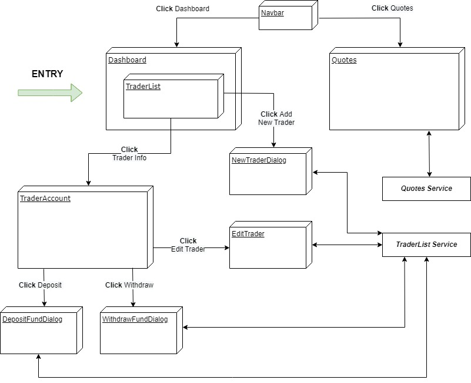

# Angular Trading Frontend Application

## Introduction
The Angular Trading application is a front-end web application designed to manage trader accounts and view quotes. Users can view a list of trader accounts and are provided with functionalities to add, update and delete trader accounts as well as manage trader funds with options to deposit and withdraw. Users can also view a daily list of quotes. The application data is accessed through RESTful APIs. 

Technologies used are Angular, Angular Material, npm, Typescript, HTML, CSS and VS Code.

## Quick Start
You should have **node** and **npm** already installed.
- Clone the project to your system

- Go to the project directory
    ```
    cd ${project_path}
    ```

- Build and serve the application
    ```
    ng serve
    ```
- Navigate to `http://localhost:4200/`.

## Implemenation
The application was implemented using the Angular framework consisting of components, services and interfaces. The Angular Material library provided prebuilt UI components for designing the application.

### Architecture
<p align="center">
  
</p>

## Test
The application was tested manually. Each feature was tested individually using different sets of inputs and sample data and was compared to the expected output. All features are working as intended.

## Deployment
Source code is managed by GitHub.

## Improvements
- Modify server-side data models and APIs to be consistent with the frontend
- Improve navigation bar features to make it more intuitive
- Add features to the Quotes page (add, remove, filter, etc.)