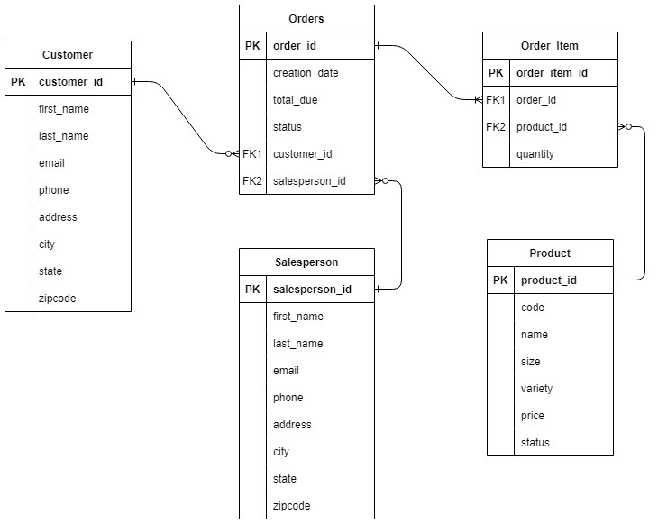

# JDBC Application

## Introduction
The application demonstrates the use of Java Database Connectivity(JDBC) to connect to a PostgreSQL database. It implements the Data Access Object(DAO) design pattern to interface and perform CRUD operations on tables in the database.

Technologies used are Core Java, JDBC, Maven, Docker, PostgreSQL, DBeaver, IntelliJ IDE.

## Implementaiton
### ER Diagram
<p align="center">
  
</p>

### Design Patterns
This project uses the Data Access Object(DAO) design pattern.

DAO and Repository are two types of design patterns that can be implemented for JDBC. DAO provides a set of abstract methods for accessing data in a database which provides abstraction for database access. Repository provides a higher-level of abstraction that can work with different data sources. This means a repository can be implemented using a DAO.

## Test
The application was tested manually using the psql command line. For each CRUD operation run using the JDBC application, the results were observed in the PostgreSQL instance using the SQL `SELECT` query on the command line.

The following command was used to connect to the PostgreSQL database for testing.
```
# Connect to the database
psql -h localhost -U postgres -d hplussport
```