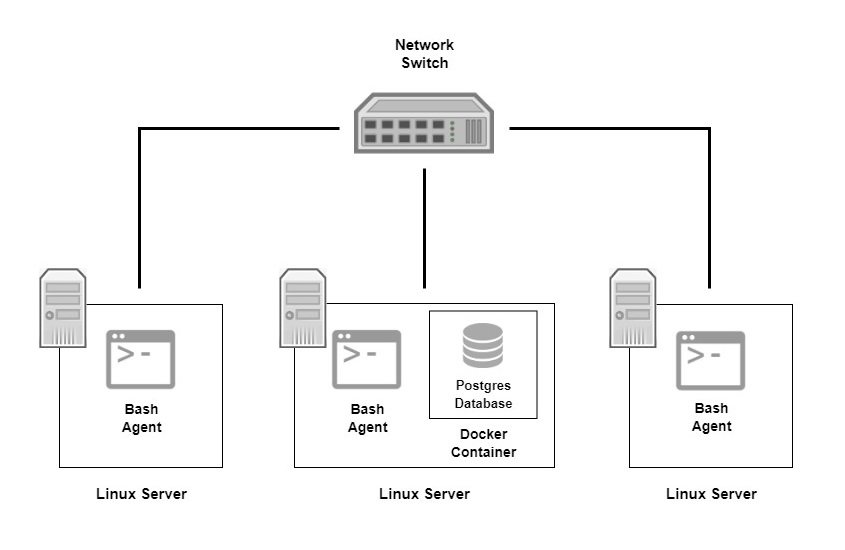

# Linux Cluster Monitoring Agent

## Introduction
The Linux Cluster Monitoring Agent is designed to monitor server resource usage (e.g. cpu, memory, disk) in real time. The agent can be installed on each node of the cluster and it will record the hardware specifications and resource usage in a database. The data can be used by cluster administration teams for future resource planning purposes. It is developed using bash, docker, postgres and git.

## Quick Start
- Create a psql instance in docker using psql_docker.sh
  ``` 
  # if pgdata volume not created
  docker volume create pgdata

  ./scripts/psql_docker.sh create postgres password
  ```
- Create database tables using ddl.sql
  ```
  # if host_agent database not created
    1. connect to psql instance
      psl -h localhost -U postgres -W 
    2. create database
      postgres=# CREATE DATABASE host_agent;

  psql -h localhost -U postgres -d host_agent -f sql/ddl.sql
  ```
- Insert hardware specs data into database using host_info.sh
  ```
  ./scripts/host_info.sh localhost 5432 host_agent postgres password
  ```
- Insert resource usage data into database using host_usage.sh
  ``` 
  ./scripts/host_usage.sh localhost 5432 host_agent postgres password
  ```
- Crontab setup
  ```
  # edit crontab jobs
  crontab -e
  
  # add this to crontab (execute every 1 min)
  * * * * * bash /home/centos/dev/jarvis_data_eng_[name]/linux_sql/scripts/host_usage.sh localhost 5432 host_agent postgres password > /tmp/host_usage.log
  ```

## Implementation
The monitoring agent is built using two bash scripts, `host_info.sh` and `host_usage.sh` for collecting and storing data. Each node on the cluster will have the monitoring agent. A PostgreSQL database is used to manage the data and is provisioned using a Docker container. It is hosted on one of the nodes in the cluster. A docker volume is to be created to persist the data.   
   
`host_info.sh` is for recording hardware specification data. The script will be run once as hardware specifications are assumed to be static. `host_usage.sh` is for recording resource usage data and is required to be run every minute. The bash job scheduler `crontab` is used to run the script every minute.
### Architecture
<p align="center">
  
</p>

### Scripts
- psql_docker.sh   
Provisions a PostgreSQL instance using docker container and can start or stop the container. `[db_username]` and `[db_password]` are required when using create.
  ``` 
  ./scripts/psql_docker.sh start|stop|create [db_username] [db_password]
  ```
- host_info.sh  
Collects hardware specifications and inserts into the database. 
  ``` 
  ./scripts/host_info.sh psql_host psql_port db_name psql_user psql_password
  ```
- host_usage.sh  
  Collects resource usage data and inserts into the database.
  ``` 
  ./scripts/host_usage.sh psql_host psql_port db_name psql_user psql_password
  ```
- crontab  
  Bash job scheduler for recording the resource usage data every minute.
  ``` 
  # edit crontab jobs
  crontab -e
  
  # add this to crontab (execute every 1 min)
  * * * * * bash [project_path]/scripts/host_usage.sh psql_host psql_port db_name psql_user psql_password > /tmp/host_usage.log
  ```
- ddl.sql  
  Creates database tables for storing hardware specification and resource usage data. The sql file is executed in the psql instance. 
  ``` 
  psql -h psql_host -U psql_user -d db_name -f sql/ddl.sql
  ```
- queries.sql  
  Contains queries for several business problems.
    - Displays memory size of each host.
    - Displays average memory usage over 5 min intervals for each host.
    - Detects host failure by checking if there are 5 new entries in a 5 min interval.

### Database Modeling

`host_info`: Hardware Specification Table

| Column Name      | Data Type    | Constraints           | Description              |
|------------------|--------------|-----------------------|--------------------------|
| id               | SERIAL       | PRIMARY KEY, NOT NULL | Unique host ID number    |
| hostname         | VARCHAR      | UNIQUE, NOT NULL      | Fully qualified hostname |
| cpu_number       | SMALLINT     | NOT NULL              | Number of CPUs           |
| cpu_architecture | VARCHAR      | NOT NULL              | CPU architecture         |
| cpu_model        | VARCHAR      | NOT NULL              | CPU model                |
| cpu_mhz          | NUMERIC(9,3) | NOT NULL              | CPU speed in MHz         |
| l2_cache         | INTEGER      | NOT NULL              | L2 cache in kB           |
| total_mem        | INTEGER      | NOT NULL              | Total memory in kB       |
| timestamp        | TIMESTAMP    | NOT NULL              | Timestamp in UTC         |

<br>

`host_usage`: Resource Usage Table

| Column Name    | Data Type | Constraints           | Description             |
|----------------|-----------|-----------------------|-------------------------|
| timestamp      | TIMESTAMP | PRIMARY KEY, NOT NULL | Timestamp in UTC        |
| host_id        | SERIAL    | FOREIGN KEY, NOT NULL | Unique host ID number   |
| memory_free    | INTEGER   | NOT NULL              | Free memory in MB       |
| cpu_idle       | SMALLINT  | NOT NULL              | CPU idle in %           |
| cpu_kernel     | SMALLINT  | NOT NULL              | CPU used by kernel in % |
| disk_io        | INTEGER   | NOT NULL              | Number of disk I/O      |
| disk_available | INTEGER   | NOT NULL              | Disk available in MB    |

## Test
All scripts were tested on a single machine. It can be assumed that the monitoring agent will perform the same in a cluster environment.   
   
The scripts were tested and verified manually using CLI commands and SQL queries. `cron` was verified by querying the database. All scripts are working as intended.

## Deployment
The agent is scheduled using `cron`. PostgreSQL database is provisioned with Docker. Source code is managed by GitHub.

## Improvements
- Handle hardware updates.
  - Automatically update the hardware specifications table when there is any hardware changes.
- Full database prevention.
  - Remove old data from the resource usage table that are past a certain duration.
- Automate agent setup
  - Create a single script to package and set up the monitoring agent (schedule cron job).
